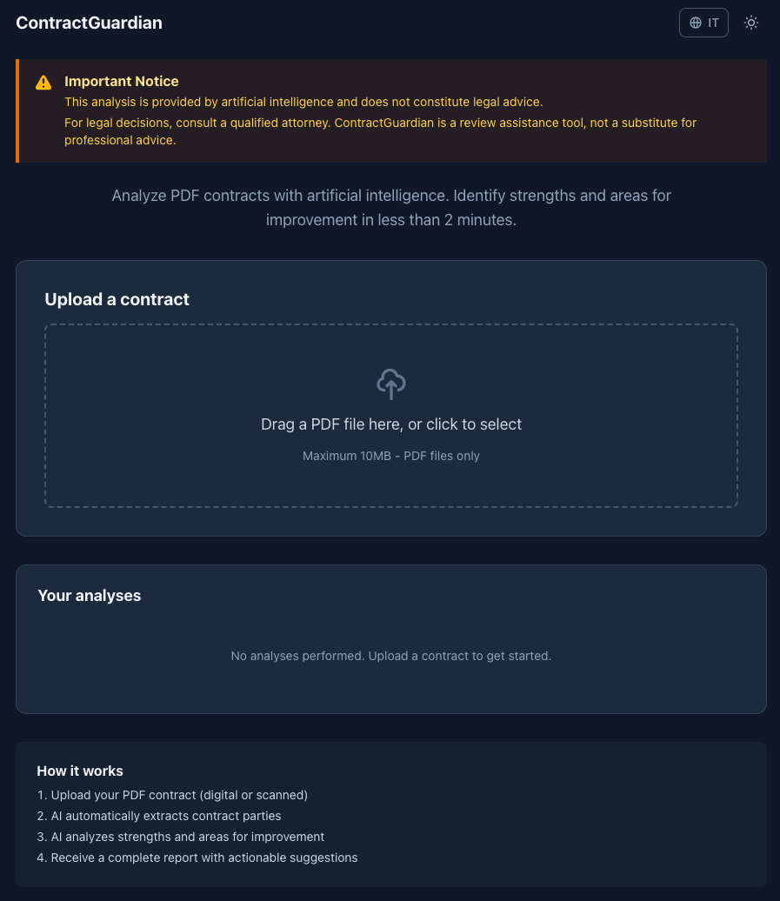
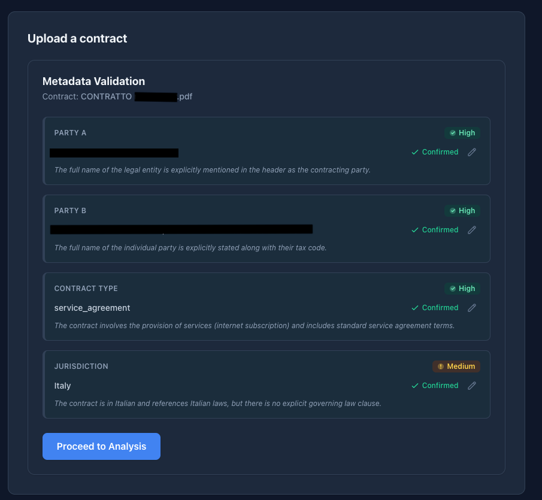

# ContractGuardian


**Automated AI-powered contract analysis. Identify legal and business risks before you sign.**

---

## Story

ContractGuardian was born while testing [Tanyra](https://tanyra.io) — a B2B meeting intelligence platform. During analysis of real contract negotiation meetings, a recurring gap emerged: contracts were being discussed without any structured risk review.

ContractGuardian is the validated prototype that solved that problem. It's open source because validating problems publicly is more credible than claiming solutions privately.

---

## What it does

1. **Upload PDF** — drag-and-drop your contract (supports scanned documents via OCR)
2. **Pre-analysis** — AI extracts parties, contract type, and jurisdiction automatically
3. **Validate** — review and correct the extracted metadata before the full analysis
4. **Enhanced analysis** — deep AI analysis enriched with relevant legal norms and citations
5. **Per-actor report** — separate risk breakdown for each party, with severity classification and cited legal references
6. **Export** — download the full report as a PDF

---

## Screenshots

**Home — Upload your contract**


**Step 1 — AI extracts and validates contract metadata**


**Step 2 — Full analysis report with per-actor findings**


---

## Features

### v1.0 — Core Pipeline
- PDF text extraction (native + OCR fallback via Tesseract.js)
- AI pre-analysis: automatic detection of parties, contract type, jurisdiction
- Interactive metadata validation before running the full analysis
- Full contract analysis with risk findings per article
- Dual-actor report view: separate findings for Party A and Party B
- Severity classification: critical / high / medium / low
- Legal norm citations embedded in findings

### v1.1 — Polish & Export
- PDF report export (pdf-lib)
- Dark mode
- Internationalization: English and Italian (next-intl)
- Analysis history: revisit past analyses
- Improved chunking for long contracts

---

## Tech Stack

| Layer | Technology |
|---|---|
| Framework | Next.js 15 App Router |
| Language | TypeScript (strict) |
| Styling | TailwindCSS v4 |
| ORM | Drizzle ORM |
| Database | Supabase (PostgreSQL) |
| AI | OpenAI GPT-4o-mini |
| PDF generation | pdf-lib |
| OCR | Tesseract.js |
| i18n | next-intl |
| Deploy | Railway |

---

## Infrastructure

ContractGuardian is built with Supabase and Railway as reference providers, but is not locked to them.

- **Database**: any PostgreSQL-compatible provider works (Neon, PlanetScale, self-hosted). Update `DATABASE_URL` accordingly.
- **Hosting**: any platform supporting Next.js standalone builds works (Vercel, Render, Fly.io, self-hosted). Railway config files are included for convenience but are not required.

The only hard dependency is a PostgreSQL database and an OpenAI API key.

---

## Getting Started

### Prerequisites
- Node.js 20+
- A [Supabase](https://supabase.com) project
- An [OpenAI](https://platform.openai.com) API key

### Setup

```bash
# 1. Clone the repository
git clone https://github.com/your-username/contractguardian.git
cd contractguardian

# 2. Copy the environment template
cp .env.example .env.local

# 3. Fill in the required variables (see .env.example for guidance)
#    - DATABASE_URL        → Supabase PostgreSQL connection string
#    - NEXT_PUBLIC_SUPABASE_URL
#    - NEXT_PUBLIC_SUPABASE_ANON_KEY
#    - OPENAI_API_KEY

# 4. Install dependencies
npm install

# 5. Push the database schema
npm run db:push

# 6. Start the dev server
npm run dev
```

Open [http://localhost:3000](http://localhost:3000).

### Environment variables

| Variable | Required | Description |
|---|---|---|
| `DATABASE_URL` | Yes | Supabase PostgreSQL connection string |
| `NEXT_PUBLIC_SUPABASE_URL` | Yes | Supabase project URL |
| `NEXT_PUBLIC_SUPABASE_ANON_KEY` | Yes | Supabase anon (public) key |
| `OPENAI_API_KEY` | Yes | OpenAI API key (GPT-4o-mini) |
| `NEXT_PUBLIC_APP_URL` | No | Base URL for the app (default: `http://localhost:3000`) |

---

## Deploy

ContractGuardian is optimised for [Railway](https://railway.app) with a standalone Next.js build.

The `railway.json` and `railpack.json` configuration files are already included in the repository.

Steps:
1. Create a new Railway project
2. Connect the repository
3. Add the environment variables in the Railway dashboard
4. Railway will auto-detect the build command and deploy

For production, use the **Session pooling** Supabase connection string (port `5432`) in `DATABASE_URL`.

---

## Roadmap — v2 ideas

- [ ] Custom analysis policies (define your own risk criteria)
- [ ] Multi-actor support (contracts with more than two parties)
- [ ] User authentication and saved contract library
- [ ] Clause-level redlining and suggested rewrites
- [ ] Webhook support for external integrations

Contributions and ideas welcome — open an issue to discuss.

---

## Contributing

See [CONTRIBUTING.md](CONTRIBUTING.md).

---

## License

MIT — see [LICENSE](LICENSE).

---

Built by [Francesco Rossberger](https://tanyra.com) · [francesco.rossberger@gmail.com](mailto:francesco.rossberger@gmail.com) | Spawned from Tanyra validation — [tanyra.com](https://tanyra.com)
